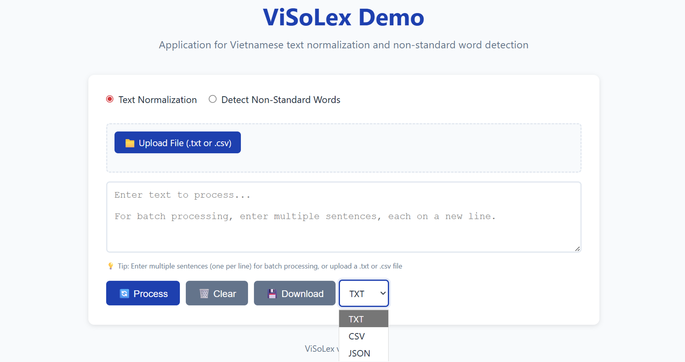
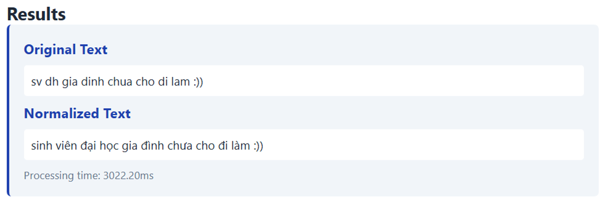
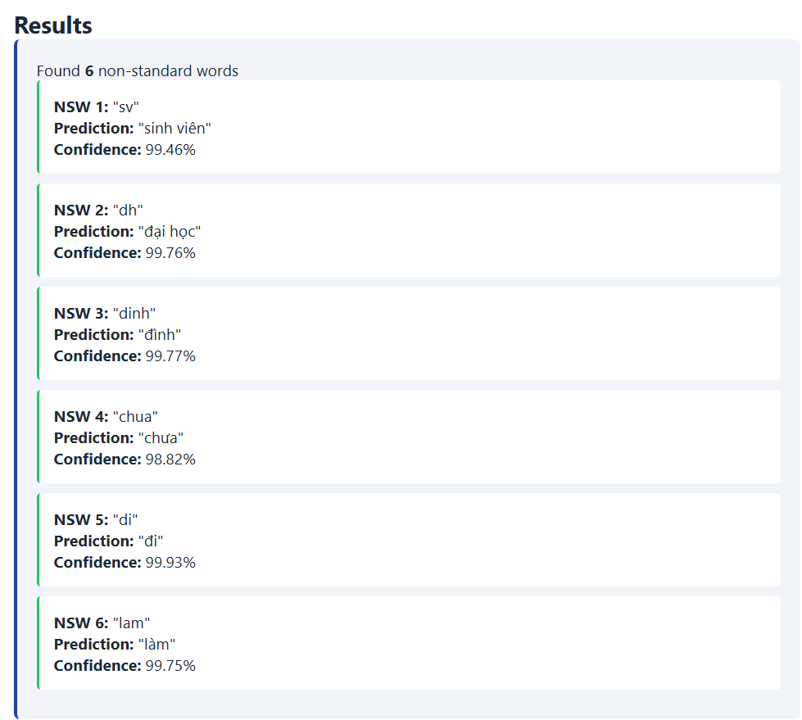

# ViSoLex: Vietnamese Text Normalization & NSW Detection Platform

> **A powerful, production-ready web application** for Vietnamese text normalization and Non-Standard Word (NSW) detection. Built with Flask and featuring a modern, responsive user interface with comprehensive API support.

## ✨ Features

### Core Functionality
- **Text Normalization**: Convert non-standard Vietnamese text to standard form using ViSoNorm (ViSoBERT) model
- **NSW Detection**: Identify and analyze non-standard words with confidence scoring
- **Batch Processing**: Process multiple texts simultaneously (via UI or API)
- **Dual Processing Modes**: Switch between normalization and NSW detection modes

### User Interface



- **Interactive Web Interface**: Modern, responsive single-page application
- **File Upload Support**: Upload `.txt` or `.csv` files for batch processing
  - Automatic CSV parsing with header detection
  - Real-time upload status feedback
  - Automatic textarea population
- **Batch Input**: Enter multiple sentences (one per line) directly in the textarea
- **Multiple Download Formats**: Export results in three formats:
  - **TXT**: Human-readable text format
  - **CSV**: Spreadsheet-compatible format (Excel-ready)
  - **JSON**: Structured data format for programmatic use
- **Visual Feedback**: Status messages, loading indicators, and success/error notifications
- **Responsive Design**: Works seamlessly on desktop, tablet, and mobile devices

### Technical Features
- **RESTful API**: Complete API for programmatic access
- **Error Handling**: Comprehensive error handling with user-friendly messages
- **Model Fallback**: Automatic fallback to mock normalizer if model unavailable
- **GPU Support**: Optional CUDA acceleration for faster processing
- **Production Ready**: Docker and Gunicorn deployment configurations included

## 📁 Project Structure

```
visolex-demo/
├── app/
│   ├── __init__.py          # Flask app factory
│   ├── main.py              # Application entry point
│   ├── api/
│   │   ├── __init__.py      # API blueprint
│   │   ├── routes.py        # API endpoints
│   │   └── schemas.py       # Request/response schemas
│   ├── models/
│   │   ├── __init__.py
│   │   ├── normalizer.py    # ViSoNorm model wrapper
│   │   └── processor.py     # High-level processing logic
│   ├── utils/
│   │   ├── __init__.py
│   │   ├── error_handling.py # Custom exceptions
│   │   └── text_processing.py # Text utilities
│   └── templates/
│       └── index.html       # Main UI template
├── static/
│   ├── css/
│   │   └── style.css        # Application styles
│   └── js/
│       └── app.js           # Frontend JavaScript
├── config.py                # Configuration settings
├── Dockerfile               # Docker container definition
├── Procfile                 # Heroku deployment config
├── runtime.txt             # Python version specification
├── requirements.txt        # Python dependencies
├── README.md               # This file
└── README_en.md            # Detailed specifications
```

## 🚀 Getting Started

### Prerequisites

- **Python 3.10+** (Python 3.12+ recommended, but 3.10+ works)
- **pip** (Python package manager)
- **Git** (optional, for cloning the repository)
- **CUDA-capable GPU** (optional, for faster inference)

### Installation

#### 1. Clone or Download the Repository

```bash
git clone <repository-url>
cd demo
```

#### 2. Create Virtual Environment

**Using venv:**
```bash
python -m venv .venv

# Windows
.venv\Scripts\activate

# macOS/Linux
source .venv/bin/activate
```

**Using conda (recommended for Python 3.10):**
```bash
conda create -n visolex python=3.10
conda activate visolex
```

#### 3. Install Dependencies

```bash
pip install --upgrade pip
pip install -r requirements.txt
```

> **Note**: The first run will download the ViSoNorm model from HuggingFace (~400MB). This may take a few minutes depending on your internet connection.

### Running the Application

#### Development Server

```bash
# Windows (PowerShell)
$env:FLASK_ENV="development"
$env:VISONORM_DEVICE="cpu"  # or "cuda" if GPU available
python -m flask --app app.main run

# macOS/Linux
export FLASK_ENV=development
export VISONORM_DEVICE=cpu  # or cuda if GPU available
python -m flask --app app.main run
```

The application will be available at **http://127.0.0.1:5000**

#### Production Server (Gunicorn)

```bash
gunicorn --bind 0.0.0.0:5000 --workers 4 app.main:app
```

#### Docker Deployment

```bash
# Build the image
docker build -t visolex-demo .

# Run the container
docker run -p 5000:5000 visolex-demo
```

## 📖 Usage Guide

### Web Interface

1. **Access the Application**: Open http://127.0.0.1:5000 in your web browser

2. **Select Processing Mode**:
   - **Text Normalization**: Convert non-standard text to standard Vietnamese
   - **Detect Non-Standard Words**: Identify and analyze NSWs in the text

3. **Input Text** (choose one method):
   - **Manual Entry**: Type or paste text directly into the textarea
   - **Batch Entry**: Enter multiple sentences, one per line
   - **File Upload**: Click "Upload File" and select a `.txt` or `.csv` file
     - For CSV files, text is extracted from the first column
     - Headers are automatically detected and skipped

4. **Process**: Click the "🔄 Process" button

5. **View Results**: Results are displayed with:
   - Original and normalized text (normalization mode)
      
   - Detected NSWs with predictions and confidence scores (NSW detection mode)
      
   - Processing time for each item

6. **Download Results**: Click "💾 Download" and select format:
   - **TXT**: Readable text format
   - **CSV**: Spreadsheet format (one NSW per row for NSW detection)
   - **JSON**: Structured JSON format

### File Upload Formats

#### Text File (.txt)
- Plain text file with one sentence per line
- Example:
  ```
  sv dh gia dinh chua cho di lam
  toi di hoc bang xe may
  ```

#### CSV File (.csv)
- Comma-separated values file
- Text is extracted from the first column
- Headers are automatically detected
- Example:
  ```csv
  text
  sv dh gia dinh chua cho di lam
  toi di hoc bang xe may
  ```

### API Usage

All API endpoints accept and return JSON. Set `Content-Type: application/json`.

#### Normalize Text

```bash
curl -X POST http://localhost:5000/api/normalize \
  -H "Content-Type: application/json" \
  -d '{"text": "sv dh gia dinh chua cho di lam", "device": "cpu"}'
```

**Response:**
```json
{
  "success": true,
  "original_text": "sv dh gia dinh chua cho di lam",
  "normalized_text": "sinh viên đại học gia đình chưa cho đi làm",
  "source_tokens": [...],
  "predicted_tokens": [...],
  "processing_time": 0.123
}
```

#### Detect Non-Standard Words

```bash
curl -X POST http://localhost:5000/api/detect-nsw \
  -H "Content-Type: application/json" \
  -d '{"text": "text with non-standard words", "device": "cpu"}'
```

**Response:**
```json
{
  "success": true,
  "text": "text with non-standard words",
  "nsw_count": 2,
  "results": [
    {
      "nsw": "sv",
      "prediction": "sinh viên",
      "confidence_score": 0.95
    }
  ],
  "processing_time": 0.234
}
```

#### Batch Process

```bash
curl -X POST http://localhost:5000/api/batch-process \
  -H "Content-Type: application/json" \
  -d '{
    "texts": [
      "sv dh gia dinh chua cho di lam",
      "toi di hoc bang xe may"
    ],
    "mode": "normalize",
    "device": "cpu"
  }'
```

**Response:**
```json
{
  "success": true,
  "total_texts": 2,
  "mode": "normalize",
  "results": [
    {
      "original": "sv dh gia dinh chua cho di lam",
      "normalized": "sinh viên đại học gia đình chưa cho đi làm",
      "processing_time": 0.123
    },
    {
      "original": "toi di hoc bang xe may",
      "normalized": "tôi đi học bằng xe máy",
      "processing_time": 0.115
    }
  ],
  "total_processing_time": 0.238
}
```

## ⚙️ Configuration

### Environment Variables

| Variable | Description | Default |
|----------|-------------|---------|
| `SECRET_KEY` | Flask session secret key | `visolex-demo-secret-key` |
| `VISONORM_MODEL_REPO` | HuggingFace model repository | `hadung1802/visobert-normalizer` |
| `VISONORM_DEVICE` | Processing device (`cpu` or `cuda`) | `cpu` |
| `VISONORM_MAX_TEXT_LENGTH` | Maximum characters per request | `5000` |
| `VISONORM_MAX_BATCH_SIZE` | Maximum entries in batch requests | `20` |
| `VISONORM_LOG_LEVEL` | Python logging level | `INFO` |

### Setting Environment Variables

**Windows (PowerShell):**
```powershell
$env:VISONORM_DEVICE="cuda"
$env:VISONORM_MAX_BATCH_SIZE="50"
```

**macOS/Linux:**
```bash
export VISONORM_DEVICE=cuda
export VISONORM_MAX_BATCH_SIZE=50
```

**Using .env file:**
Create a `.env` file in the project root:
```
VISONORM_DEVICE=cuda
VISONORM_MAX_BATCH_SIZE=50
VISONORM_LOG_LEVEL=DEBUG
```

## 🔧 Troubleshooting

### Model Download Issues

If the HuggingFace model cannot be downloaded:
- The app automatically falls back to a mock normalizer
- Check your internet connection
- Verify HuggingFace access (may require login for some models)
- Model files are cached in `~/.cache/huggingface/`

### Python Version Compatibility

- **Python 3.13**: Some packages may require compilation. Consider using Python 3.10-3.12.
- **Python 3.10+**: Fully supported and recommended.

### GPU/CUDA Issues

- Ensure CUDA drivers are installed
- Verify PyTorch CUDA compatibility: `python -c "import torch; print(torch.cuda.is_available())"`
- If CUDA is unavailable, the app defaults to CPU mode

### File Upload Not Working

- Ensure file is `.txt` or `.csv` format
- Check browser console for JavaScript errors
- Verify file is not empty
- For CSV files, ensure text is in the first column

## 🧪 Testing

### Manual Testing

1. **Web Interface**: Test all features through the browser
2. **API Testing**: Use `curl`, Postman, or REST Client
3. **File Upload**: Test with various `.txt` and `.csv` files

### Automated Testing (Future)

- Unit tests: `pytest` for schema validation and processor logic
- Integration tests: `pytest` + `FlaskClient` for API endpoints
- Performance tests: `locust` or `k6` for load testing

## 🚢 Deployment

### Heroku

1. Create a `Procfile` (already included)
2. Set environment variables in Heroku dashboard
3. Deploy: `git push heroku main`

### Docker

```bash
# Build
docker build -t visolex-demo .

# Run
docker run -p 5000:5000 \
  -e VISONORM_DEVICE=cuda \
  visolex-demo
```

### Kubernetes

Use the provided `Dockerfile` as base image and mount model cache volume for persistence.

### GPU Servers

1. Set `VISONORM_DEVICE=cuda`
2. Ensure CUDA drivers and PyTorch CUDA build match
3. Monitor GPU memory usage for batch processing

## 👥 Authors

* **Anh Thi-Hoang Nguyen** – University of Information Technology, Vietnam National University Ho Chi Minh City (UIT, VNU-HCM) – Maintainer – anhnth@uit.edu.vn
* **Ha Dung Nguyen** – University of Information Technology, Vietnam National University Ho Chi Minh City (UIT, VNU-HCM) – Maintainer – dungngh@uit.edu.vn
* **Kiet Van Nguyen** – University of Information Technology, Vietnam National University Ho Chi Minh City (UIT, VNU-HCM) – Maintainer – kietnv@uit.edu.vn

## 📝 License

MIT License (or align with main project policy). Feel free to customize for your research or production needs.

## 🤝 Contributing

Contributions are welcome! Please feel free to submit issues, feature requests, or pull requests.

## 📚 Additional Resources

- **Detailed Specifications**: See `README_en.md` for comprehensive documentation
- **ViSoLex Project**: [Link to main project repository]
- **Model Repository**: [HuggingFace Model Card](https://huggingface.co/hadung1802/visobert-normalizer)

---

**Version**: 1.0  
**Last Updated**: 2024
